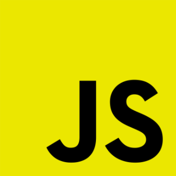
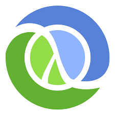
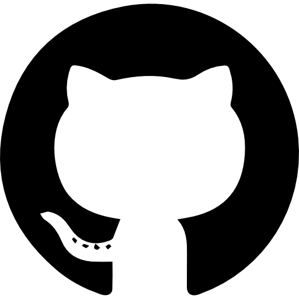

<h1><strong>🤓 h o L a!</strong></h1>
<h2><strong>✨ Bienvenue sur ma page! ✨</strong></h2>

# I'm Alejandra 

and I'm a language enthusiast 🗣ï¸

I mean: Spanish 🇲🇽&nbsp; French 🇫🇷&nbsp; Arabic 🇸🇾&nbsp; Portuguese 🇵🇹&nbsp; Russian 🇷🇺&nbsp; etc.     

One day I decided to experiment with how similar (or not) it would be to learn <em>cyber</em> languages, and I haven't looked back! When I'm not coding or learning other languages, I'm perfecting my handle on the art of international cuisines, watching hidden-gem foreign films, painting oils on canvas or reading in my book nook 📚

I also love discovering the beautiful idiosyncrasies of a country and its people, so I look very forward to traveling the world with my remote job in programming! ğŸŒ

Some of the things I've been working on include:

## My Skills

&nbsp;   

## Skills Am Learning

 &nbsp;&nbsp;&nbsp; &nbsp;&nbsp; 

## Tools I Use

&nbsp; &nbsp; 

## Where I Hangout

&nbsp;&nbsp; 

## What I've been up to

<!-- 

 -->