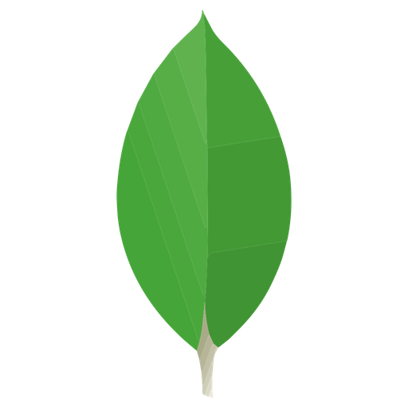

<h1><strong>Hi👋</strong></h1>

# I'm Alejandra 

I am a language enthusiast!

I mean: Spanish, French, Portuguese, Russian, Arabic, etc. ;)

One day I decided to make an experiment to see how similar (or not) it would be to learn cyber ones, and I haven't looked back! When I'm not coding, I'm perfecting my handle on the art of international cuisines, watching hidden-gem foreign films, painting oils on canvas or reading in my book nook. 

I also love discovering the beautiful idiosyncrasies of a country and its people, so I look very forward to traveling the world with my remote job in programming!

Some of the things I've been working on include:

## My Skills

   

## Skills Am Learning

     

## Tools I Use

   

## Where I Hangout

## What I've been up to

